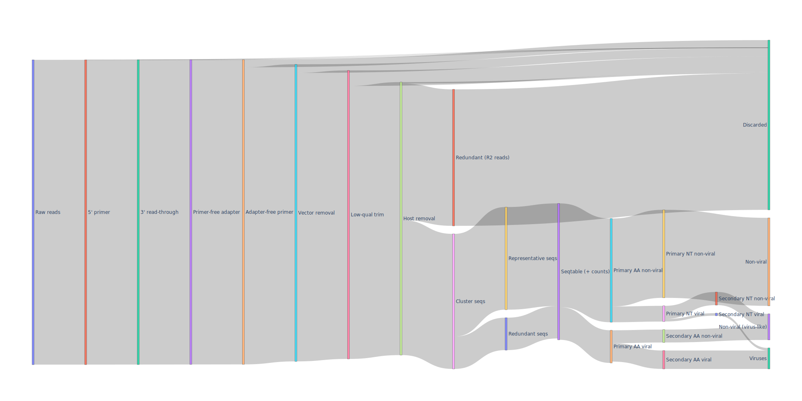

The pipeline outputs a number of files for further analysis and exploration, as well as to provide an overview of the 
read preprocessing and distribution.

## Report

`report.html`

This file is generated by Snakemake and outlines a lot of information relating to the Hecatomb run.
Under the Results tabs are summary files for things like reads for each sample following different preprocessing steps
as well as some summary plots.

## SeqTable

`hecatomb_out/RESULTS/seqtable.fasta`

The SeqTable is the primary output of the read preprocessing and serves as the input for Taxonomic assignment.
It is composed of all the representative sequences from the clustered reads for all samples.
Samples are clustered individually, and the seq IDs for this fasta file follows the format `>sampleID:count:seqNumber`.
Here, `count` is the number of reads in that cluster which is important for statistical exploration.
Sequences are numbered sequentially (`seqNumber`) to ensure unique IDs.

## BigTable

`hecatomb_out/RESULTS/bigtable.tsv`

The BigTable is the main output of Taxonomic assignment and can be directly imported into R or Python.
The BigTable combines the seqtable IDs with their sampleID, counts, normalised counts, alignment information, taxonomic assignments and Baltimore classification.
This file is big, hence the name, but is designed to make merging with sample metadata, plotting, and statistical interrogation as easy as possible.

The header looks like this:

```text
seqID  sampleID  count  CPM  alnType  targetID  evalue  pident  fident  nident  mismatches  qcov  tcov  qstart  qend  qlen  tstart  tend  tlen  alnlen  bits  targetName  taxMethod  kingdom  phylum  class  order  family  genus  species  baltimoreType  baltimoreGroup
```

## TaxonLevelCounts

`hecatomb_report/taxonLevelCounts.tsv`

This file is derived from the BigTable and summarises the total sequence counts, for each sample, at all taxonomic levels.
The TaxonLevelCounts combines the sampleID with the taxonomic level for which the counts refer, the full taxonomic path, 
the taxon name, and the total and normalised read counts.
The purpose of this file is to expedite statistical interrogation of your data.
For instance, if you wanted to compare the numbers of say Flaviviridae reads between two groups of samples, 
those counts have already been collected, and you can simply run your analysis and plotting on the relevant slice of the table.  

The file looks something like this:

```text
sampleID    taxonLevel  taxonPath                                   taxonName       count   CPM
sample1     Kingdom     k_Bacteria                                  Bacteria        3162    3178.818
sample1     phylum      K_Viruses,p_Phixviricota                    Phixviricota    1216    1222.467
sample1     class       K_Viruses,p_Uroviricota,c_Caudoviricetes    Caudoviricetes  1234    1240.564
etc.
```

## Assembly

`hecatomb_out/RESULTS/assembly.fasta`

These are the contigs generated UNLESS you run Hecatomb with the `--skipAssembly` flag.
The assembly is used for producing the ContigSeqTable and ContigKrona plots, as well as the direct contig annotations.

## CONTIG ANNOTATIONS

TODO

## ContigSeqTable

`hecatomb_out/RESULTS/contigSeqTable.tsv`

The ContigSeqTable combines the read mapping information for the assembly with the read-based taxonomic assignments.
This file is intended to assist the user in identifying and binning assembly contigs by applying a consensus approach to contig taxonomic assignment.
The file includes the positional mapping information and can also enable investigation of more complex features such as 
chimeric contigs, recombination or horizontal transfer events.

The header looks like this:

```text
contigID  seqID  start  stop  len  qual  count  CPM  alnType  taxMethod  kingdom  phylum  class  order  family  genus  species  baltimoreType  baltimoreGroup
```

## Sankey

`hecatomb_report/Sankey.svg`

The sankey diagram shows the fate of all reads throughout the preprocessing and read-based taxonomic assignment steps.
It serves to visualise the read filtering and distribution of taxonomic assignment methods and give you an overall impression of how well things went.
The sankey diagram produced for the test dataset is shown below. 
This dataset is relatively rich in viral sequences and yet the majority of reads are either filtered or non-viral (that we know of).

[](img/Sankey.svg)

## krona.html and contigKrona.html

`hecatomb_report/krona.html`

`hecatomb_report/contigKrona.html`

The Krona plots are to assist in visual exploration of the read annotations.
krona.html is derived from the bigtable and shows the raw distribution of taxon assignments.
contigKrona.html is derived from the contigSeqTable and includeds the taxon assignment method (either tophit or LCA).
The contigKrona plot helps to visualise the distributions of topHit versus LCA assigned reads as well as the 
distributions over contigs of the identified species, and the distribution of taxonomic assignments for each contig.
