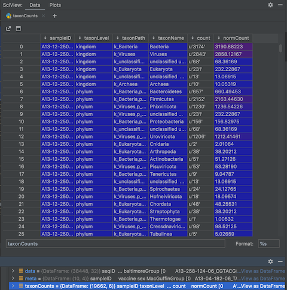
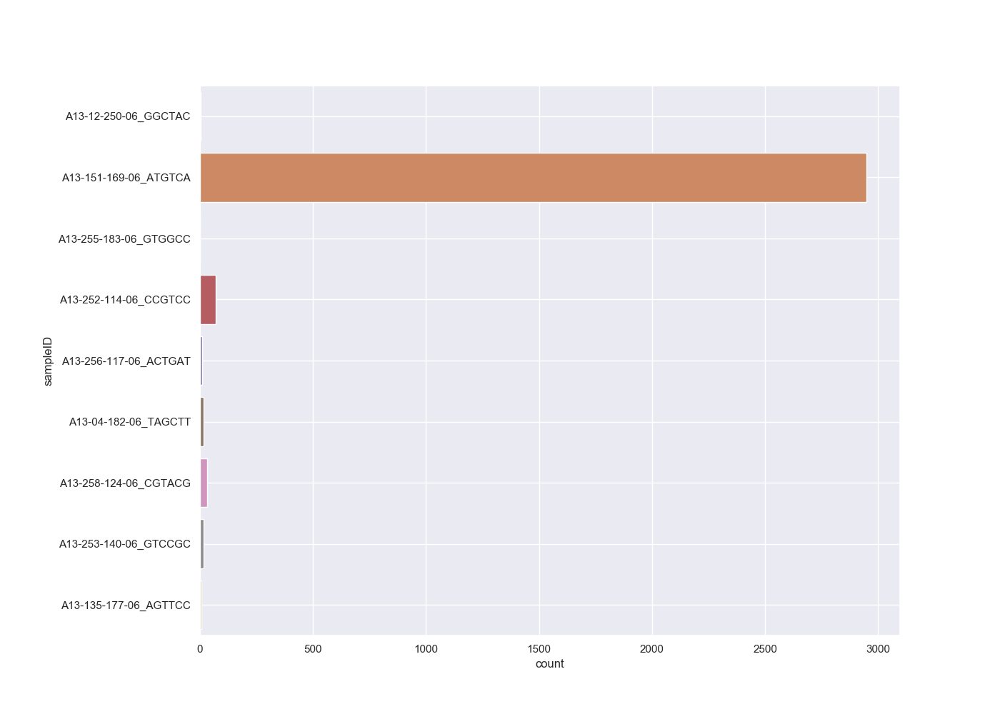
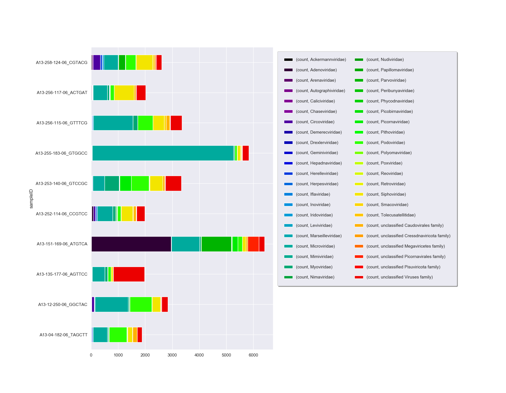

This section assumes you have finished Tutorials [Part 1](pythontTutorialPt1.md) and [Part 2](pythonTutorialPt2.md)

## Unfiltered taxon counts

The `taxonLevelCounts.tsv` file is intended to make it quick and easy to compare virus hit counts across samples.
Let's look at the file by clicking on the 'View As DataFrame' link next to the 'taxonCounts' DataFrame:

[](img/pythonTaxCountTable.png)

The file contains the counts and normalised counts for each taxonomic level, for each sample, 
based on the raw (unfiltered) hit counts.
If we wanted to compare the number of Adenoviridae hits between each sample we could pull out the Adenoviridae counts and plot them:

```python
# get adenoviridae counts
adenoCounts = taxonCounts[(taxonCounts.taxonLevel=='family') & (taxonCounts.taxonName=='Adenoviridae')]

# plot
sns.set_style("darkgrid")
sns.set_palette("colorblind")
sns.set(rc={'figure.figsize':(14,10)})
sns.barplot(x="count", y="sampleID", data=adenoCounts)
plt.subplots_adjust(left=0.2)
plt.grid(True)
plt.show()
```

[](img/pythonTutAdenoBar.png)

We can take this one step further and plot all the viral family normalised counts for each sample, in a stacked bar chart:

```python
# get all viral family counts
viralCounts = taxonCounts[(taxonCounts.taxonLevel=='family') & (taxonCounts.taxonPath.str.contains('k_Viruses'))]

# plot
sns.set_style("darkgrid")
sns.set(rc={'figure.figsize':(18,14)})
colors = plt.cm.nipy_spectral(np.linspace(0, 1, 50))
viralCountsChartPivot=pd.pivot_table(viralCounts, index=['sampleID'], columns=['taxonName'], values=['count'], aggfunc='sum')
plt.figure();
viralCountsChartPivot.plot.barh(stacked=True,color=colors);
plt.subplots_adjust(left=0.18)
# Shink current axis by 50% to allow legend to fit nicely
ax = plt.gca()
box = ax.get_position()
ax.set_position([box.x0, box.y0, box.width * 0.5, box.height])
plt.legend(loc="upper left", bbox_to_anchor=(1.0, 1.0), borderaxespad=1,ncol=2, shadow=True, labelspacing=1.5, borderpad=1.5)
plt.show()
```

[](img/pythonTutViralCounts.png)

## Generating taxon counts

The `taxonLevelCounts.tsv` file is convenient for comparing the raw counts,
but you will likely want to generate new counts from your _filtered_ hits.
Recreate the above plot from the filtered hits by first summing the counts
or normalisedCounts, e.g. at the family level:

```R
# Answer for "Challenge: Filter your raw viral hits to only keep protein hits with an evalue < 1e-10"
virusesFiltered = viruses[(viruses.alnType=='aa') & (viruses.evalue<1e-10)]

# collect the filtered counts
viralFiltCounts = virusesFiltered.groupby(by=['sampleID','family'], as_index=False)['normCount'].agg('sum')
```
** TO DO UP TO HERE**

Then plot again. 
This time we use `position='fill'` to make it look like 16s data, so we can confuse people.
We'll also add `theme_bw()` because grey is ugly:

```R
ggplot(viralFiltCounts) +
    geom_bar(aes(x=sampleID,y=n,fill=family),position='fill',stat='identity') +
    coord_flip() +
    theme_bw()
```

[](img/tuteViralFiltCounts.png)

These count tables we will use for plotting and some statistical comparisons.

# Challenge

**Make a stacked bar chart of the viral families for the Male and Female monkeys**


# Visualising groups

We have a few viral families that are very prominent in our samples.
Let's see if there is a difference in viral loads according to our sample groups.
Collect sample counts for _Microviridae_.
Include the metadata group in `group_by()` so you can use it in the plot.

```R
microCounts = virusesFiltered %>% 
    group_by(family,sampleID,MacGuffinGroup) %>% 
    filter(family=='Microviridae') %>% 
    summarise(n = sum(normCount))
```

And plot. I like jitter plots but boxplots or violin plots might work better if you have hundreds of samples.

```R
ggplot(microCounts) +
    geom_jitter(aes(x=MacGuffinGroup,y=n),width = 0.1) +
    theme_bw()
```


Let's do the same for _Podoviridae_.

```R
# collect counts
podoCounts = virusesFiltered %>% 
    group_by(family,sampleID,MacGuffinGroup) %>% 
    filter(family=='Podoviridae') %>% 
    summarise(n = sum(normCount))

# plot
ggplot(podoCounts) +
    geom_jitter(aes(x=MacGuffinGroup,y=n),width = 0.1) +
    theme_bw()
```


# Challenge

**Could gender be a good predictor of viral load for these families?**

While the MacGuffinGroup looks promising for _Podoviridae_, 
we'll need to [move on to Part 4: statistical tests](tutorialPt4.md) to find out for sure. 
