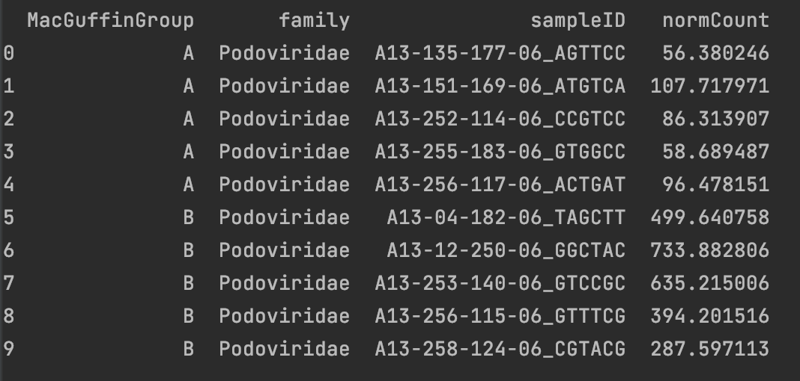
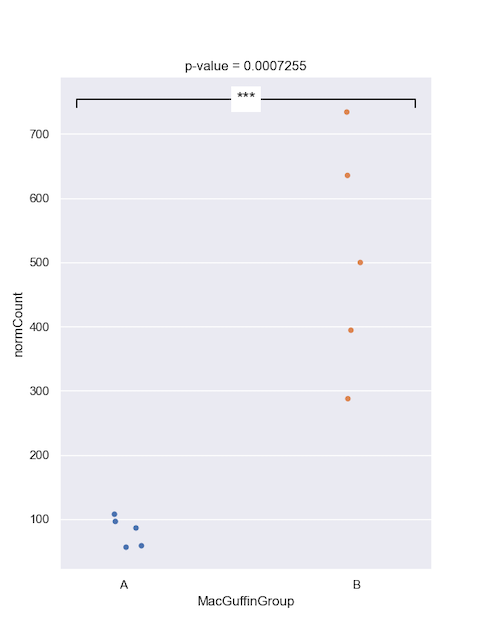
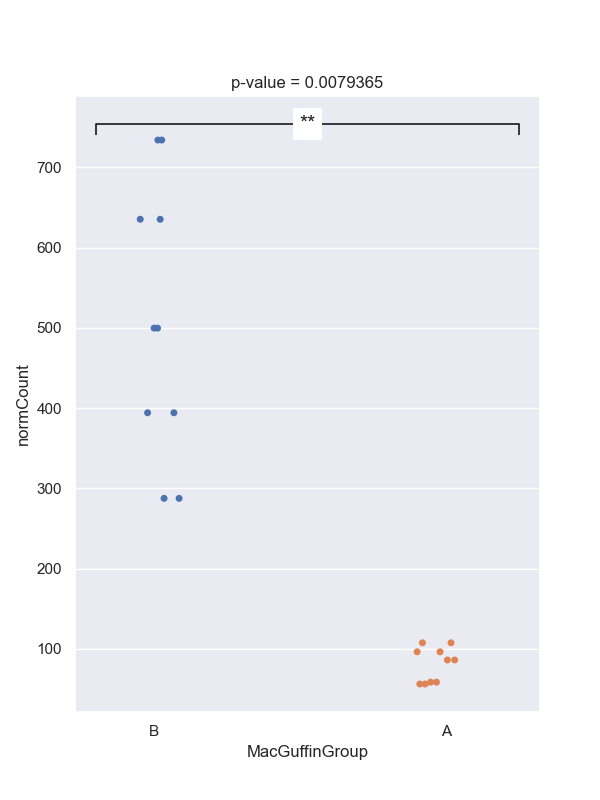
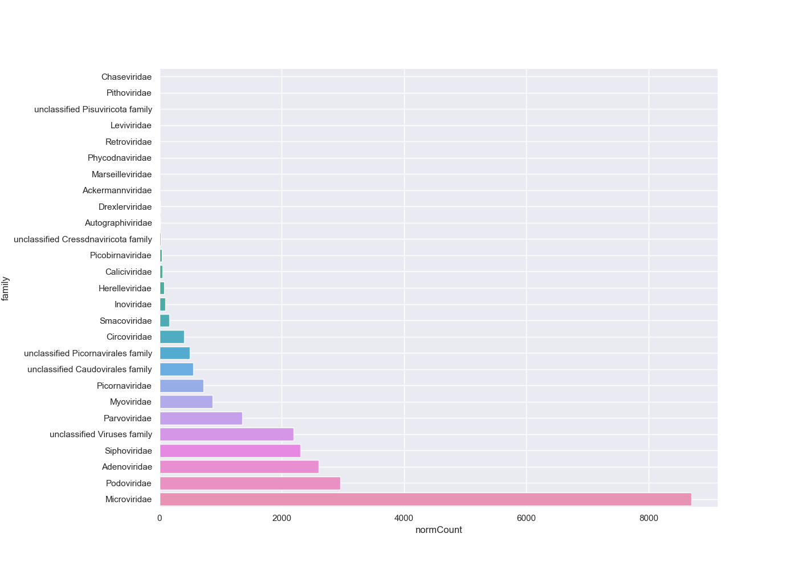

This section assumes you have completed [Tutorial Part3](tutorialPt3.md).

# Compare viral loads

In part 3, we compared the viral counts between the two sample groups for _Podoviridae_,
and it appeared as though group B had more viral sequence hits on average than group A.
We can compare the normalised counts for these two groups to see if they're significantly different.

**Student's T-test**

Let's check out the dataframe we made earlier that we'll be using for the test:

```python
print(podoCounts)
```



We'll use the python function `stats.ttest_ind`, which takes two vectors--one with the 
group A counts and one with the group B counts.
We will first filter then group the data before using the t-test function. You'll also need to import the 'scipy.stats' library.

```python
#add to top with the other import statements
import scipy.stats as stats

#filter
virusesFilteredA = viruses[(viruses.family=='Podoviridae') & (viruses.alnType=='aa') & (viruses.evalue<1e-10) & (viruses.MacGuffinGroup == 'A')]
virusesFilteredB = viruses[(viruses.family=='Podoviridae') & (viruses.alnType=='aa') & (viruses.evalue<1e-10) & (viruses.MacGuffinGroup == 'B')]

#group by
podoCountsA = virusesFilteredA.groupby(by=['family','sampleID'], as_index=False)['normCount'].agg('sum')
podoCountsB = virusesFilteredB.groupby(by=['family','sampleID'], as_index=False)['normCount'].agg('sum')

#two-sided test
df = len(podoCountsA) + len(podoCountsB) - 2
t_stat, p_val = stats.ttest_ind(podoCountsA.normCount, podoCountsB.normCount, equal_var=True)

print(f"t-test = {t_stat:.4f}", "\n",
          f"p-value = {p_val:.7f}", "\n",
          f"Degrees of Freedom = {df:.0f}")
```

```text

t-test = -5.3033 
p-value = 0.0007255
Degrees of Freedom = 8

```
Alternative hypothesis: true difference in means is not equal to 0

Below is example of how to plot the p-value significant notation manually onto graph
```python
#plot
from matplotlib.markers import TICKDOWN

sns.set_style("darkgrid")
sns.set_palette("colorblind")
sns.set(rc={'figure.figsize':(6,8)})
ax = sns.stripplot(x="MacGuffinGroup",
                    y="normCount",
                    data=podoCounts, jitter=0.1)

#plot p-value
def significance_bar(start,end,height,displaystring,linewidth = 1.2,markersize = 8,boxpad  =0.3,fontsize = 15,color = 'k'):
    # draw a line with downticks at the ends
    plt.plot([start,end],[height]*2,'-',color = color,lw=linewidth,marker = TICKDOWN,markeredgewidth=linewidth,markersize = markersize)
    # draw the text with a bounding box covering up the line
    plt.text(0.5*(start+end),height,displaystring,ha = 'center',va='center',bbox=dict(facecolor='1.', edgecolor='none',boxstyle='Square,pad='+str(boxpad)),size = fontsize)

if p_val < 0.0001:
    pValAsterisk = '****'
elif p_val < 0.001:
  pValAsterisk = '***'
elif p_val < 0.01:
  pValAsterisk = '**'
elif p_val < 0.05:
  pValAsterisk = '*'
else:
  'ns'

height = podoCounts["normCount"].max()+20
significance_bar(-.2,1.25,height,pValAsterisk)
ax.set_title(f"p-value = {p_val:.7f}")
plt.show()

```



**Wilcoxon test**

You might prefer to perform a Wilcoxon test; the syntax is very similar to the t.test.

```python
#Wilcoxon test
stat, p_val = stats.mannwhitneyu(x=podoCountsA.normCount, y=podoCountsB.normCount, alternative = 'two-sided')
print('Wilcoxon rank sum exact test')
print('Statistics=%.3f, p=%.6f' % (stat, p_val))
```

```text
Wilcoxon rank sum exact test
Statistics=0.000, p=0.007937
```

Then plot
```python
#plot
from matplotlib.markers import TICKDOWN

sns.set_style("darkgrid")
sns.set_palette("colorblind")
sns.set(rc={'figure.figsize':(6,8)})
ax = sns.stripplot(x="MacGuffinGroup",
                    y="normCount",
                    data=podoCounts, jitter=0.1)

#plot p-value
def significance_bar(start,end,height,displaystring,linewidth = 1.2,markersize = 8,boxpad  =0.3,fontsize = 15,color = 'k'):
    # draw a line with downticks at the ends
    plt.plot([start,end],[height]*2,'-',color = color,lw=linewidth,marker = TICKDOWN,markeredgewidth=linewidth,markersize = markersize)
    # draw the text with a bounding box covering up the line
    plt.text(0.5*(start+end),height,displaystring,ha = 'center',va='center',bbox=dict(facecolor='1.', edgecolor='none',boxstyle='Square,pad='+str(boxpad)),size = fontsize)

if p_val < 0.0001:
    pValAsterisk = '****'
elif p_val < 0.001:
  pValAsterisk = '***'
elif p_val < 0.01:
  pValAsterisk = '**'
elif p_val < 0.05:
  pValAsterisk = '*'
else:
  'ns'

height = podoCounts["normCount"].max()+20
significance_bar(-.2,1.25,height,pValAsterisk)
ax.set_title(f"p-value = {p_val:.7f}")
plt.show()
```



**Dunn's test**

Let's use Dunn's test to check all the major families at the same time.
Dunn's is good for if you have three or more categories for a metadata field, such as our vaccine column.
First find out what the major families are by summing the hits for each family and sorting the table.

```python
#filter
virusesFiltered = viruses[(viruses.alnType=='aa') & (viruses.evalue<1e-10)]

#group by
viralFamCounts = virusesFiltered.groupby(by=['family'], as_index=False)['normCount'].agg('sum')
viralFamCounts = viralFamCounts.sort_values(by=['normCount'])

# plot
sns.set_style("darkgrid")
sns.set_palette("colorblind")
sns.set(rc={'figure.figsize':(12,8)})
sns.barplot(x="normCount", y="family", data=viralFamCounts)
plt.subplots_adjust(left=0.2)
plt.grid(True)
plt.show()
```



Let's focus on _Siphoviridae_, _Adenoviridae_, _Podoviridae_, and _Microviridae_.
Collect summary counts for these families for each sample and include the metadata we want to use:

```python
# filter out all but top families
virusesFiltered = viruses[(viruses['family'].isin(['Siphoviridae','Adenoviridae','Podoviridae','Microviridae'])) & (viruses.alnType=='aa') & (viruses.evalue<1e-10)]

# group and collect the counts
viralMajorFamCounts = virusesFiltered.groupby(by=['family','vaccine','sampleID'], as_index=False).sum('normCount')

# Dunn's test on Siphoviridae
from scikit_posthocs import posthoc_dunn
posthoc_dunn(viralMajorFamCounts[viralMajorFamCounts['family']=='Siphoviridae'], val_col = 'normCount', group_col = 'vaccine')
```

```text
            Ad_alone  Ad_protein      sham
Ad_alone    1.000000    0.017142  0.242908
Ad_protein  0.017142    1.000000  0.152661
sham        0.242908    0.152661  1.000000
```

```python
# Use a loop to run Dunn's test on all families
for i in viralMajorFamCounts['family'].unique():
    print(i)
    print(posthoc_dunn(viralMajorFamCounts[viralMajorFamCounts['family']==i], val_col = 'normCount', group_col = 'vaccine'))
    print('\n')
```

```text
Adenoviridae
            Ad_alone  Ad_protein      sham
Ad_alone    1.000000    0.640738  0.661205
Ad_protein  0.640738    1.000000  0.916051
sham        0.661205    0.916051  1.000000

Microviridae
            Ad_alone  Ad_protein      sham
Ad_alone    1.000000    0.181926  0.350201
Ad_protein  0.181926    1.000000  0.567269
sham        0.350201    0.567269  1.000000

Podoviridae
            Ad_alone  Ad_protein      sham
Ad_alone    1.000000    0.633553  0.079839
Ad_protein  0.633553    1.000000  0.340356
sham        0.079839    0.340356  1.000000

Siphoviridae
            Ad_alone  Ad_protein      sham
Ad_alone    1.000000    0.017142  0.242908
Ad_protein  0.017142    1.000000  0.152661
sham        0.242908    0.152661  1.000000
```

We can then plot any interesting or significant differences like we did above for the Student's t-test or the Wilcoxon test.

# Compare presence/absence

You might not care about viral loads and instead are just interested in comparing the presence or absence of viruses.
For this you could use a Fisher's exact test.
To perform this test you need to assign a presence '1' or absence '0' for each viral family/genus/etc for each sample.
What number of hits you use for deciding if a virus is present is up to you.

I want to be sure about the alignments, so I'll apply some stringent filtering cutoffs.
Then I'll assign anything with _any_ hits as 'present' for that viral family.
Let's look at _Myoviridae_ ... for no particular reason.
 
```python
#filter
virusesFiltered = viruses[(viruses.family=='Myoviridae') & (viruses.alnType=='aa') & (viruses.evalue<1e-30) & (viruses.alnlen>150) & (viruses.pident>75)]

#group by
myovirPresAbs = virusesFiltered.groupby(by=['sampleID'], as_index=False, dropna=False)['normCount'].agg('sum')
myovirPresAbs = pd.merge(myovirPresAbs, meta, on=["sampleID"], how="outer")
myovirPresAbs["normCount"].fillna(0, inplace = True)
myovirPresAbs = myovirPresAbs.assign(present = np.where((myovirPresAbs.normCount>0),1,0))
```

To do the Fisher's exact test we need to specify a 2x2 grid;
The first column will be the number with _Myoviridae_ for each group.
The second column will be the numbers without for each group.

```python
# matrix rows
#count of rows
mtxGroupAPresentCount = len(myovirPresAbs[(myovirPresAbs.MacGuffinGroup=='A') & (myovirPresAbs.present == 1)])
mtxGroupAAbsentCount = len(myovirPresAbs[(myovirPresAbs.MacGuffinGroup=='A') & (myovirPresAbs.present == 0)])
mtxGroupBPresentCount = len(myovirPresAbs[(myovirPresAbs.MacGuffinGroup=='B') & (myovirPresAbs.present == 1)])
mtxGroupBAbsentCount = len(myovirPresAbs[(myovirPresAbs.MacGuffinGroup=='B') & (myovirPresAbs.present == 0)])

#create matrix table
myovirFishMtx = np.array([[mtxGroupAPresentCount, mtxGroupAAbsentCount], [mtxGroupBPresentCount, mtxGroupBAbsentCount]])


```


```python
#Run Fisher's exact test
oddsr, p = stats.fisher_exact(myovirFishMtx)
print('Run Fishers exact test')
print('odds ratio=%.0f, p-value=%.5f' % (oddsr, p))
```

```text
Fisher's Exact Test for Count Data
odds ratio=0, p-value=0.04762
```

Alternative hypothesis: true odds ratio is not equal to 1

We don't have many samples, so our significance won't be great regardless.

In [Part 5](tutorialPt5.md) we will look at the contigs' read-based annotations.