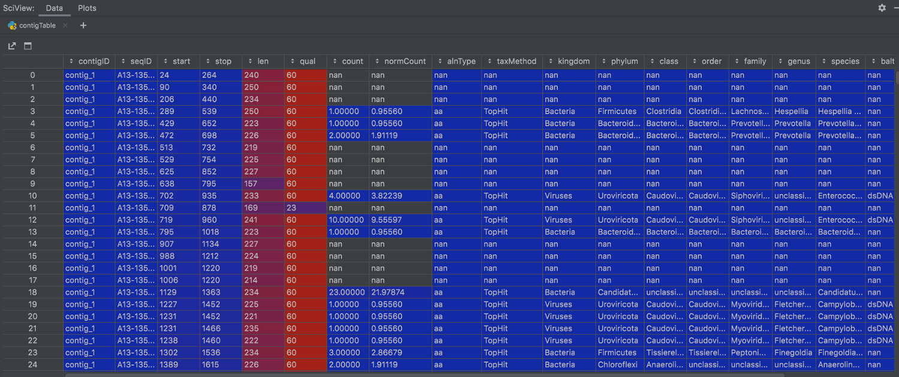
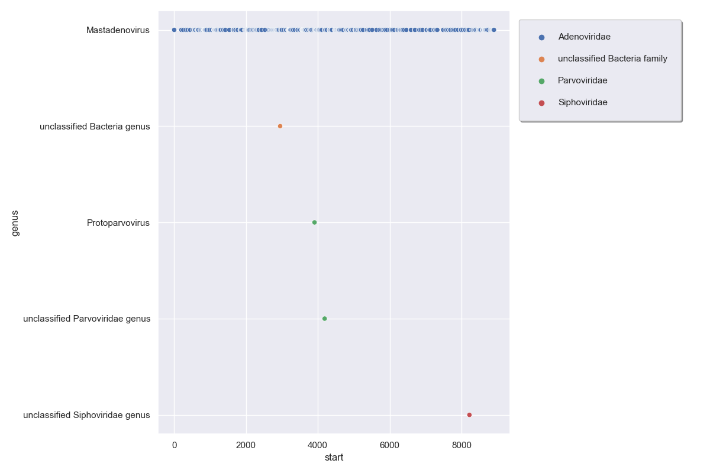
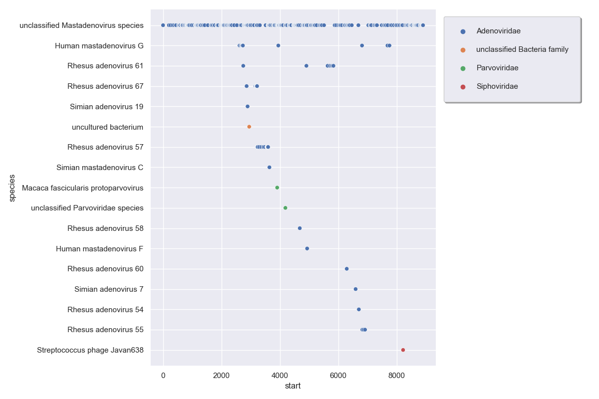
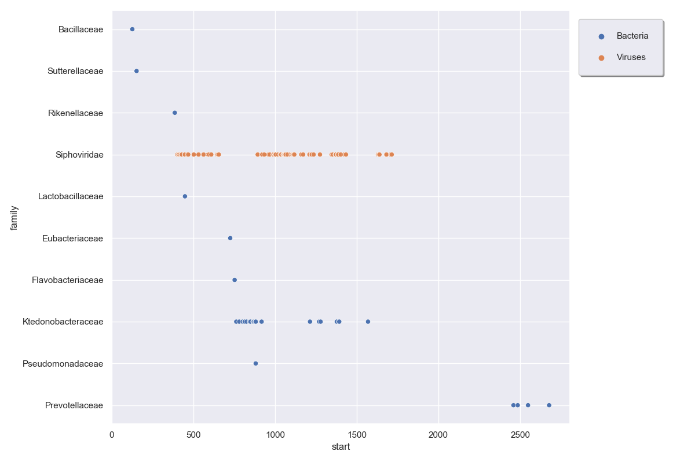
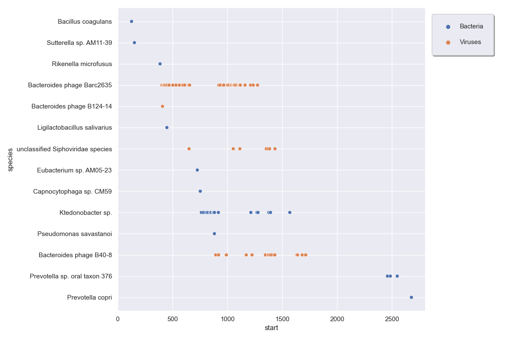

# Contig read-based annotations

Hecatomb will produce an assembly and annotate your reads.
It will also combine the two, mapping your annotated reads to the assembly and 
building a table to combine the mapped coordinates and the reads' annotations.

Load the table and have a look:

```R
contigTable = read.csv('contigSeqTable.tsv.gz',header=T,sep='\t')

View(contigTable)
```

[](img/pythonTutCtgTbl.png)

It contains the sequences from the seqtable with contig mapping coordinates, 
mapping quality, counts, and taxonomic annotations.
You could also join this with the bigtable to bring in everything for each sequence.
The premise behind this table was to enable dynamic taxonomic assignments for 
the assembly contigs.
This is still a work in progress,
but we will show some example plots to demonstrate the idea.

Let's look at what reads are mapping to contig_6.
We will separate out the reads by genus and color by family:

```python
#plot
sns.set_style("darkgrid")
sns.set(rc={'figure.figsize':(12,8)})
sns.scatterplot(x="start", y="genus", data=contigTable[(contigTable.contigID=='contig_6')], hue="family")
plt.tight_layout()
# Shink current axis by 50% to allow legend to fit nicely
ax = plt.gca()
box = ax.get_position()
ax.set_position([box.x0, box.y0, box.width * 0.65, box.height])
plt.legend(loc="upper left", bbox_to_anchor=(1.0, 1.0), borderaxespad=1,ncol=1, shadow=True, labelspacing=1.5, borderpad=1.5)
plt.show()
```

[](img/pythonTutCtg6.png)

There is a nice clear consensus that this is a Mastadenovirus.
The handful of other reads we could fairly confidently reassign as such if we wanted.
Given the clear consensus, it might be possible to assign it to a specific species:

```python
#TODO CHECK IF OK nan values aren't shown as python is filtering them out
#plot
sns.set_style("darkgrid")
sns.set(rc={'figure.figsize':(12,8)})
sns.scatterplot(x="start", y="species", data=contigTable[(contigTable.contigID=='contig_6')], hue="family")
plt.tight_layout()
# Shink current axis by 50% to allow legend to fit nicely
ax = plt.gca()
box = ax.get_position()
ax.set_position([box.x0, box.y0, box.width * 0.65, box.height])
plt.legend(loc="upper left", bbox_to_anchor=(1.0, 1.0), borderaxespad=1,ncol=1, shadow=True, labelspacing=1.5, borderpad=1.5)
plt.show()
```

[](img/pythonTutCtg6Sp.png)

Unfortunately its closest hit in the reference databases is an unclassified species.
However, its next closest hits are to Rhesus adenoviruses, which makes sense for this Macaque sample.

Lets look at contig_56:

```python
#TODO CHECK IF OK nan values aren't shown as python is filtering them out
#plot
sns.set_style("darkgrid")
sns.set(rc={'figure.figsize':(12,8)})
sns.scatterplot(x="start", y="family", data=contigTable[(contigTable.contigID=='contig_56')], hue="kingdom")
plt.tight_layout()
# Shink current axis by 50% to allow legend to fit nicely
ax = plt.gca()
box = ax.get_position()
ax.set_position([box.x0, box.y0, box.width * 0.8, box.height])
plt.legend(loc="upper left", bbox_to_anchor=(1.0, 1.0), borderaxespad=1,ncol=1, shadow=True, labelspacing=1.5, borderpad=1.5)
plt.show()
```

[](img/pythonTutCtg56.png)

Most of the hits remain unclassified, and the classified hits are split between kingdoms.
Let's see what species the sequences are hitting:

```python
sns.set_style("darkgrid")
sns.set(rc={'figure.figsize':(12,8)})
sns.scatterplot(x="start", y="species", data=contigTable[(contigTable.contigID=='contig_56')], hue="kingdom", plotnonfinite=True)
plt.tight_layout()
# Shink current axis by 50% to allow legend to fit nicely
ax = plt.gca()
box = ax.get_position()
ax.set_position([box.x0, box.y0, box.width * 0.8, box.height])
plt.legend(loc="upper left", bbox_to_anchor=(1.0, 1.0), borderaxespad=1,ncol=1, shadow=True, labelspacing=1.5, borderpad=1.5)
plt.show()
```

[](img/pythonTutCtg56Sp.png)

The annotates hits are split between _Bacteroides_ phage species, 
and a _Ktedonobacter_ bacteria species. 
The contig could represent a novel phage species, or a novel prophage in a bacteria genome.

We think this is a cool analysis with lots of potential, but we would love your feedback!
