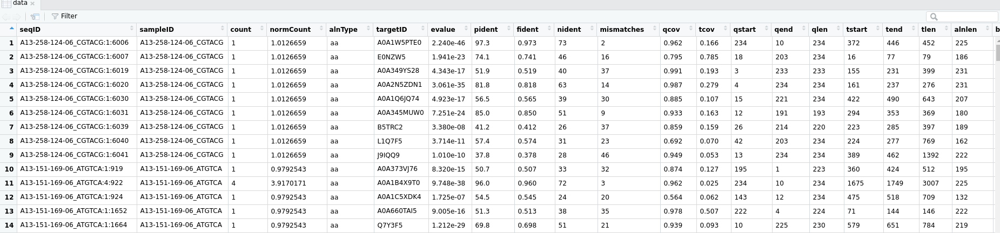
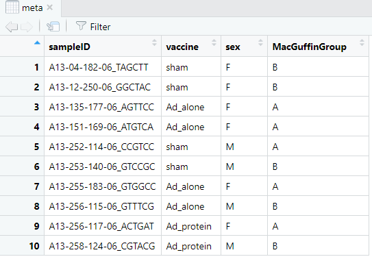
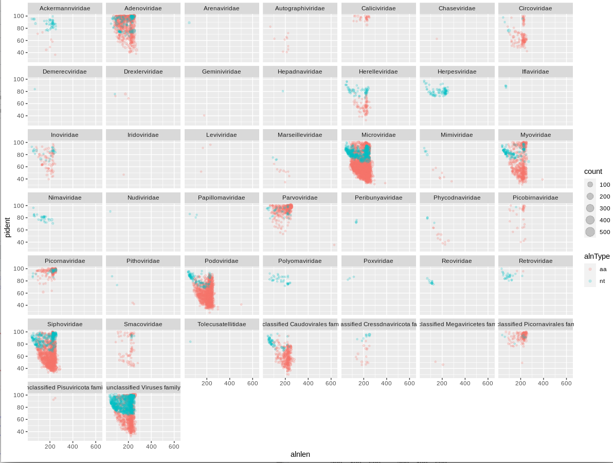
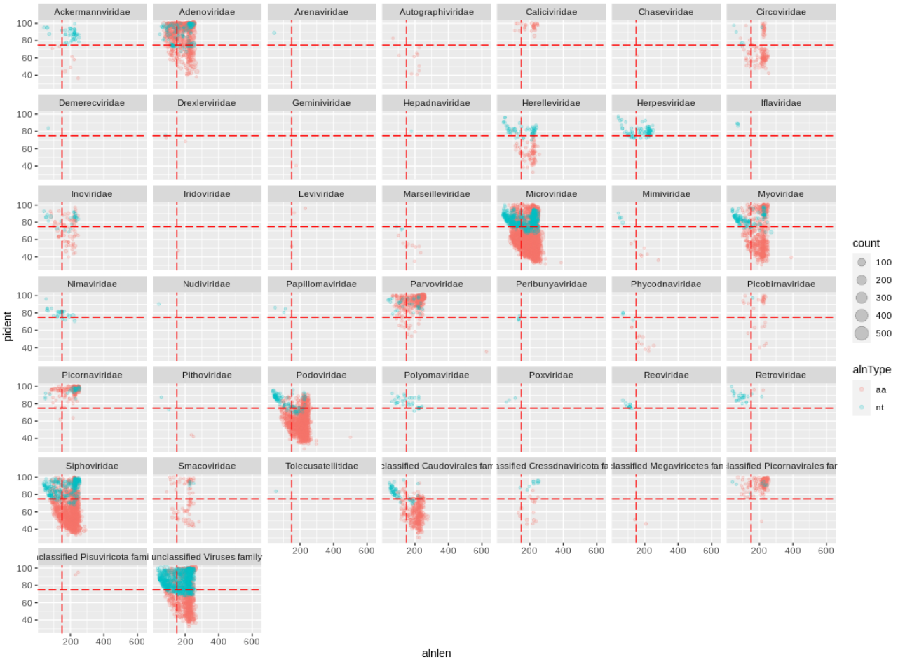
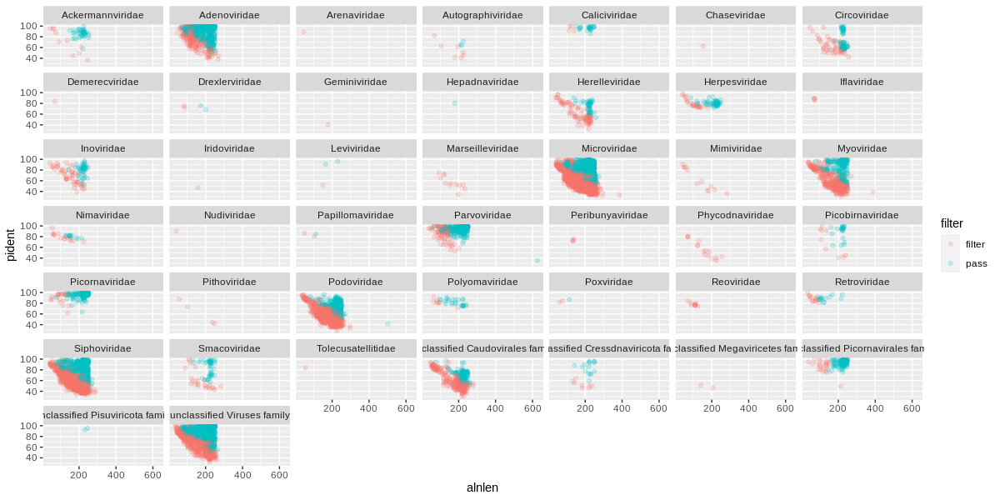
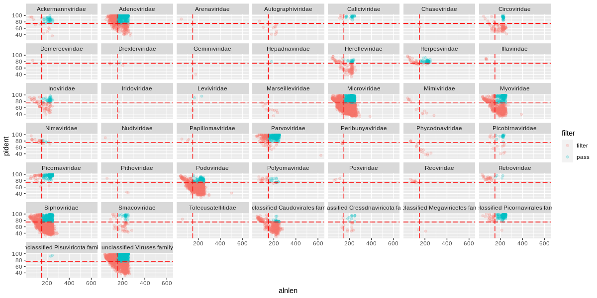

This section assumes you have finished [Part 1: Preparation](tutorialPt1.md) by downloading the `bigtable.tsv.gz` and `metadata.tsv.gz`, 
and have loaded them in Rstudio into dataframes called `data` and `meta`.

## Inspect the dataframes

Let's look at the bigtable file:

```R
# in R/Rstudio
View(data)
```

[](img/tuteDataTable.png)

And the metadata:

```R
View(meta)
```



For the metadata table I've made sure the column header for the sample IDs are the same in both tables.
There was more metadata associated with the original samples, but we've simplified things here.

## Merge in the metadata

Merging in your metadata is easy.

The merge function with perform an inner join by default, or you can specify outer, and left- and right-outer.
This shouldn't matter if you have metadata for all of your samples.

```R
# save the merged tables to a new dataframe
dataMeta = merge(data, meta, by='sampleID')

# If your metadata is incomplete and you want to keep all samples
dataMeta = merge(data, meta, by='sampleID', all=T)
```

## Preliminary bigtable plots

Let's look at the raw alignments.
First, extract the viral hits to a new data frame. 

```R
viruses = dataMeta %>% 
    filter(kingdom=="Viruses")
```

I like to plot the alignment length against identity, and facet by viral family.
We show the different alignment types by color, and we can scale the point size by the cluster number.
I've added in `alpha=0.1` to set it to 10% opacity and the points will overlap a lot at this scale.

```R
ggplot(viruses) + 
    geom_point(
        aes(x=alnlen,y=pident,color=alnType,size=count),
        alpha=0.1) + 
    facet_wrap(~family)
```

[](img/tuteAlnPidFam.png)

We can immediately see that a handful of viral families make up a majority of the viral hits.
You can use these plots to help guide filtering strategies.
We can divide the alignments into 'quadrants' by adding alignment length and percent identity thresholds,
for instance alignment length of 150 and percent identity of 75. 

```R
ggplot(viruses) +
    geom_point(
        aes(x=alnlen,y=pident,color=alnType,size=count),
        alpha=0.1) +
    facet_wrap(~family) +
    geom_vline(xintercept=150,colour='red',linetype='longdash') +
    geom_hline(yintercept=75,colour='red',linetype='longdash')
```

[](img/tuteAlnPidFamQuad.png)

We can see that for Adenoviridae and Parvoviridae the majority of hits occupy the top two quadrants, 
and we can be reasonably confident about these alignments.
For Podoviridae and Circoviridae, the majority of hits occupy the bottom two quadrants.
This could indicate that the viruses are only distantly related to the reference genomes in these families.

## Challenges

**Can you plot the Bacterial hits faceted by phylum?**

Don't facet the bacterial hits by family, there will be way too many panels.

**Can you plot the Adenoviridae hits for each sample?**

You can use `%>% filter(...)` inside the `ggplot()` function.


## Filtering strategies

Hecatomb is not intended to be a black box of predetermined filtering cutoffs that returns an immutable table of hits.
Instead, it delivers as much information as possible to empower the user to decide which hits they want to keep and which hits to purge.
Let's take our raw viral hits dataframe `viruses` and filter them to only keep the ones we are confident about.

The evalue is one of the most common metrics to use for filtering alignments.
Let's see what hits would be removed if we used a fairly stringent cutoff of 1e-20.

You can return a filtered dataframe like so:

```R
virusesFiltered = viruses %>% 
    filter(evalue<1e-20)
```

But let's instead add a flag to the original dataframe for purging hits:

```R
# mutate() will add or modify columns, ifelse() will return a value base on a condition
viruses = viruses %>% 
    mutate(filter=ifelse(evalue<1e-20,'pass','filter'))
```

And plot:

```R
ggplot(viruses) +
    geom_point(
        aes(x=alnlen,y=pident,color=filter),
        alpha=0.2) +
    facet_wrap(~family)
```

[](img/tuteVirEvalFilt.png)

The orange (or red?) sequences are destined to be removed, while the blue-green sequences will be kept.
Some viral families will be removed altogether, which is probably a good thing if they only have low quality hits.

Going back to the quadrant concept, you might only want to keep sequences above a certain length and percent identity:

```R
# this will overwrite the flags with the new designations
viruses = viruses %>% 
    mutate(filter=ifelse(alnlen>150 & pident>75,'pass','filter'))
```

Plot with the vertical and horizontal lines to match our cutoffs:

```R
ggplot(viruses) +
    geom_point(
        aes(x=alnlen,y=pident,color=filter),
        alpha=0.2) +
    facet_wrap(~family) +
    geom_vline(xintercept=150,colour='red',linetype='longdash') +
    geom_hline(yintercept=75,colour='red',linetype='longdash')
```

[](img/tuteVirLenFilt.png)

There are many alignment metrics included in the bigtable for you to choose from.

**Other suggestions**

In our previous plots, we were colouring alignments by alignment type ('aa' or 'nt' under 'alnType')
Hecatomb will only attempt to identify nucleotide hits for a sequence if there is no protein hit.
We generally expect more protein than nucleotide hits as intergenic space is generally small in viral genomes.
A high nucleotide:protein hit ratio could be the result of false-positive hits, 
and you may wish to ignore nucleotide hits in some circumstances.

Hecatomb will try to assign taxonomy using a Lowest Common Ancestor approach ('LCA' under 'taxMethod').
If the LCA calculation fails, then Hecatomb defaults to the top hit ('TopHit' under 'taxMethod').
You may or may not wish to include the top hit-based annotations, 
or ignore top hit annotations if there are no accompanying LCA-based annotations.

## Challenge

**Filter your raw viral hits to only keep protein hits with an evalue < 1e-10**

Save it to `virusesFiltered` and move on to [Part 3: visualising annotations](tutorialPt3.md).
