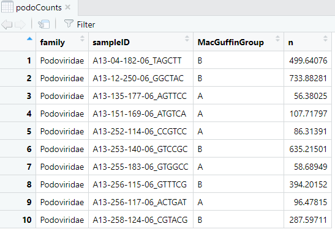
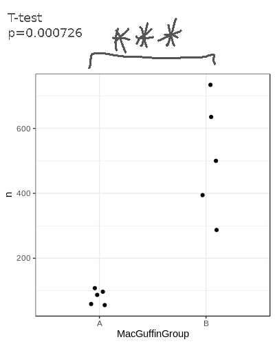
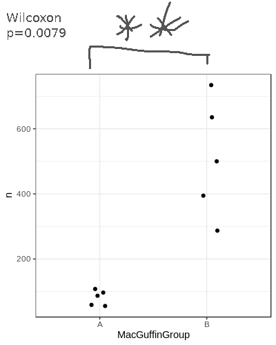
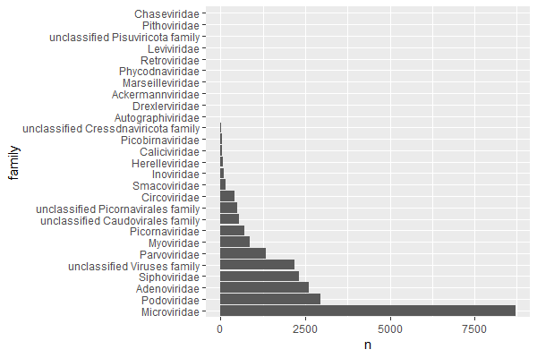
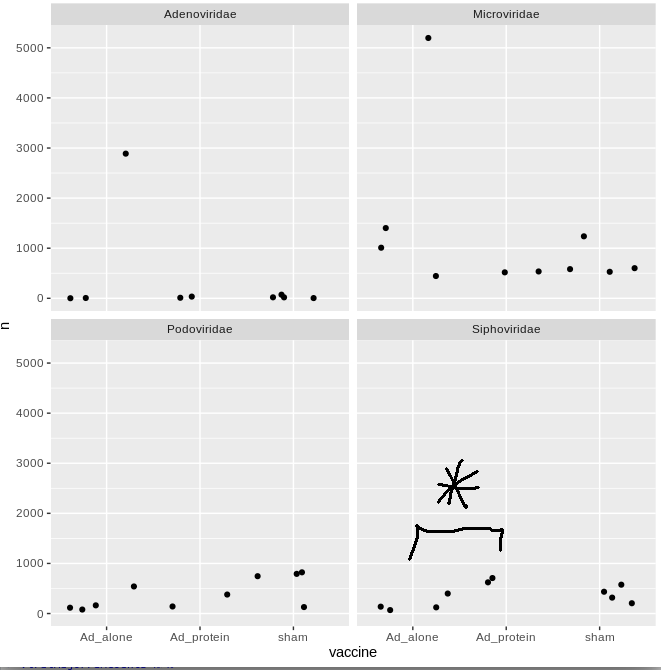
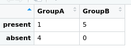

This section assumes you have completed [Tutorial Part3](tutorialPt3.md).

# Compare viral loads

In part 3, we compared the viral counts between the two sample groups for _Podoviridae_,
and it appeared as though group B had more viral sequence hits on average than group A.
We can compare the normalised counts for these two groups to see if they're significantly different.

**Student's T-test**

Let's check out the dataframe we made earlier that we'll be using for the test:

```R
View(podoCounts)
```



We'll use the base-r function `t.test()`, which takes two vectors--one with the 
group A counts and one with the group B counts.
We can use the `filter()` and `pull()` functions within the `t.test()` function like so:

```R
t.test(
    podoCounts %>% 
        filter(MacGuffinGroup=='A') %>% 
        pull(n),
    podoCounts %>% 
        filter(MacGuffinGroup=='B') %>% 
        pull(n),
    alternative='two.sided',
    paired=F,
    var.equal=T)    
```

```text
	Two Sample t-test

data:  podoCounts %>% filter(MacGuffinGroup == "A") %>% pull(n) and podoCounts %>% filter(MacGuffinGroup == "B") %>% pull(n)
t = -5.3033, df = 8, p-value = 0.0007255
alternative hypothesis: true difference in means is not equal to 0
95 percent confidence interval:
 -615.5267 -242.4563
sample estimates:
mean of x mean of y 
 81.11595 510.10744 
```

**Note: for all the following plots, I've manually added the significance asterisks.**



**Wilcoxon test**

You might prefer to perform a Wilcoxon test; the syntax is very similar to the t.test:

```R
wilcox.test(
    podoCounts %>% 
        filter(MacGuffinGroup=='A') %>% 
        pull(n),
    podoCounts %>% 
        filter(MacGuffinGroup=='B') %>% 
        pull(n),
    alternative='t',
    paired=F)
```

```text
	Wilcoxon rank sum exact test

data:  podoCounts %>% filter(MacGuffinGroup == "A") %>% pull(n) and podoCounts %>% filter(MacGuffinGroup == "B") %>% pull(n)
W = 0, p-value = 0.007937
alternative hypothesis: true location shift is not equal to 0
```



**Dunn's test**

Let's use Dunn's test to check all the major families at the same time.
Dunn's is good for if you have three or more categories for a metadata field, such as our vaccine column.
First find out what the major families are by summing the hits for each family and sorting the table.

```R
# collect the family counts
viralFamCounts = virusesFiltered %>% 
    group_by(family) %>% 
    summarise(n=sum(CPM)) %>% 
    arrange(desc(n))

# update factor levels to the sorted order
viralFamCounts$family = factor(viralFamCounts$family,levels=viralFamCounts$family)
```

and plot:

```R
ggplot(viralFamCounts) +
    geom_bar(aes(x=family,y=n),stat='identity') +
    coord_flip()
```



Let's focus on _Siphoviridae_, _Adenoviridae_, _Podoviridae_, and _Microviridae_.
Collect summary counts for these families for each sample and include the metadata we want to use:

```R
viralMajorFamCounts = viruses %>% 
    filter(family %in% c('Siphoviridae','Adenoviridae','Podoviridae','Microviridae')) %>% 
    group_by(sampleID,family,vaccine) %>% 
    summarise(n=sum(CPM))
```

Now let's do the dunn's test for these families:

```R
viralMajorFamCounts %>% 
    group_by(family) %>% 
    dunn_test(n ~ vaccine,p.adjust.method='holm') %>% 
    add_significance()
```

```text
# A tibble: 12 × 10
   family       .y.   group1     group2        n1    n2 statistic      p  p.adj p.adj.signif
 * <chr>        <chr> <chr>      <chr>      <int> <int>     <dbl>  <dbl>  <dbl> <chr>       
 1 Adenoviridae n     Ad_alone   Ad_protein     3     2     0.467 0.641  1      ns          
 2 Adenoviridae n     Ad_alone   sham           3     4     0.438 0.661  1      ns          
 3 Adenoviridae n     Ad_protein sham           2     4    -0.105 0.916  1      ns          
 4 Microviridae n     Ad_alone   Ad_protein     4     2    -1.43  0.153  0.458  ns          
 5 Microviridae n     Ad_alone   sham           4     4    -0.584 0.559  0.681  ns          
 6 Microviridae n     Ad_protein sham           2     4     0.953 0.340  0.681  ns          
 7 Podoviridae  n     Ad_alone   Ad_protein     4     2     0.477 0.634  0.681  ns          
 8 Podoviridae  n     Ad_alone   sham           4     4     1.75  0.0798 0.240  ns          
 9 Podoviridae  n     Ad_protein sham           2     4     0.953 0.340  0.681  ns          
10 Siphoviridae n     Ad_alone   Ad_protein     4     2     2.48  0.0132 0.0395 *           
11 Siphoviridae n     Ad_alone   sham           4     4     1.40  0.161  0.322  ns          
12 Siphoviridae n     Ad_protein sham           2     4    -1.33  0.182  0.322  ns  
```

There's only one comparison that is significant.
Let's put it on a plot

```R
ggplot(viralMajorFamCounts) +
    geom_jitter(aes(x=vaccine,y=n)) +
    facet_wrap(~family)
```



# Compare presence/absence

You might not care about viral loads and instead are just interested in comparing the presence or absence of viruses.
For this you could use a Fisher's exact test.
To perform this test you need to assign a presence '1' or absence '0' for each viral family/genus/etc for each sample.
What number of hits you use for deciding if a virus is present is up to you.

I want to be sure about the alignments, so I'll apply some stringent filtering cutoffs.
Then I'll assign anything with _any_ hits as 'present' for that viral family.
Let's look at _Myoviridae_ ... for no particular reason.
 
```R
# apply a stringent filter
virusesStringent = viruses %>% 
    filter(evalue<1e-30,alnlen>150,pident>75,alnType=='aa')

# count hits for Myoviridae and score presence
# NOTE: the absent samples WONT be in the table yet, we have to add them in after
myovirPresAbs = virusesStringent %>% 
    filter(family=='Myoviridae') %>%
    group_by(sampleID) %>% 
    summarise(n=sum(CPM)) %>%
    mutate(present=ifelse(n>0,1,0))

# merge in the metadata
# Using all=T will do an outer join and bring in the absent samples
myovirPresAbs = merge(myovirPresAbs,meta,by='sampleID',all=T)

# convert na's to zeros
myovirPresAbs[is.na(myovirPresAbs)] = 0
```

To do the Fisher's exact test we need to specify a 2x2 grid;
The first column will be the number with _Myoviridae_ for each group.
The second column will be the numbers without for each group.

```R
# matrix rows
mtxGroupA = c(
    myovirPresAbs %>% 
        filter(MacGuffinGroup=='A',present==1) %>% 
        summarise(n=n()) %>% 
        pull(n),
    myovirPresAbs %>% 
        filter(MacGuffinGroup=='A',present==0) %>% 
        summarise(n=n()) %>% 
        pull(n))
mtxGroupB = c(
    myovirPresAbs %>% 
        filter(MacGuffinGroup=='B',present==1) %>% 
        summarise(n=n()) %>% 
        pull(n),
    myovirPresAbs %>% 
        filter(MacGuffinGroup=='B',present==0) %>% 
        summarise(n=n()) %>% 
        pull(n))

# create the 2x2 matrix
myovirFishMtx = matrix(c(mtxGroupA,mtxGroupB),nrow = 2)

# this bit is not necessary, but lets add row and col names to illustrate the matrix layout
colnames(myovirFishMtx) = c('GroupA','GroupB')
row.names(myovirFishMtx) = c('present','absent')

# view
View(myovirFishMtx)
```



```R
# Run Fisher's exact test
fisher.test(myovirFishMtx)
```

```text
	Fisher's Exact Test for Count Data

data:  myovirFishMtx
p-value = 0.04762
alternative hypothesis: true odds ratio is not equal to 1
95 percent confidence interval:
 0.000000 0.975779
sample estimates:
odds ratio 
         0 
```

We don't have many samples, so our significance won't be great regardless.

In [Part 5](tutorialPt5.md) we will look at the contigs' read-based annotations.